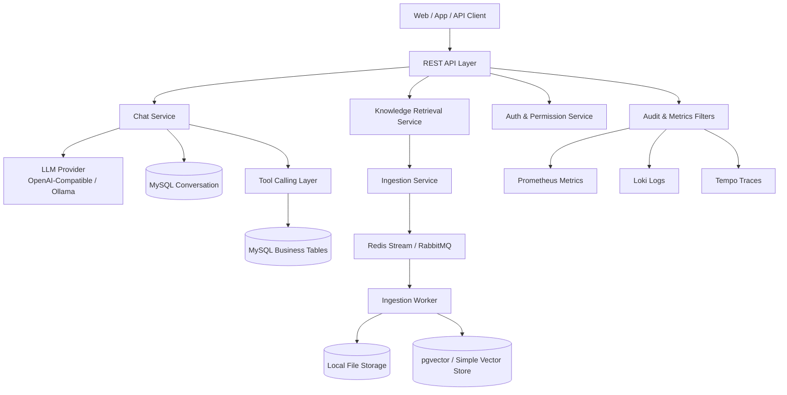

# Intelligent Q&A and Knowledge Retrieval Platform | 智能问答与知识检索平台

🔥 Enterprise-ready Spring AI backend for intelligent Q&A, retrieval augmentation, and controlled tool execution.  
🚀 Built with Spring Boot, Spring AI, MySQL, Redis/RabbitMQ, pgvector, and full observability components.  
⭐ Supports secure deployment, asynchronous ingestion, auditability, and production operations.

> 一个面向企业落地的智能问答与知识检索平台后端工程，覆盖“会话问答、知识入库、检索增强、工具调用、安全治理、可观测与运维”全链路。  
> 本仓库定位为可部署、可运维、可扩展的生产级基线，面向长期业务迭代。

## 项目主周期（Main Timeline）

- `main 日期`：`2025.12 - 2026.01`
- `推进次数`：约 `14` 次（十几次迭代）

---

## 目录

- 项目定位
- 企业级能力矩阵
- 技术栈与版本基线
- 架构总览
- 核心模块
- 快速开始
- 容器化部署
- 生产部署建议
- 环境变量与配置项
- API 概览
- 安全与权限体系
- 可观测与运维
- 测试与质量保障
- 性能与容量规划
- 文档索引
- 路线图

---

## 项目定位

本项目提供企业场景下可直接对接业务系统的 AI 后端能力，重点解决以下问题：

1. 如何把对话能力稳定落在业务流程中，而不是仅做单轮聊天。
2. 如何把 PDF/文档知识接入检索增强链路，并保证可追溯来源。
3. 如何让工具调用具备权限边界、审计记录和失败可恢复机制。
4. 如何实现线上可运维：日志、指标、链路追踪、告警、回归评测闭环。

适用场景：

- 智能客服与企业知识问答
- 内部知识库检索问答（文档上传、切片、向量化、检索）
- 需要 AI + 业务工具联合执行的流程型场景

---

## 企业级能力矩阵

| 能力域 | 当前实现 |
|---|---|
| 对话与多模态 | `/ai/chat` 支持文本与附件输入、流式输出 |
| 检索增强（RAG） | `/ai/pdf/upload/{chatId}` + `/ai/pdf/chat`，支持引用来源输出 |
| 异步入库流水线 | 队列化 ingestion、幂等键、重试、DLQ、状态查询 |
| 安全体系 | API Key + JWT + Refresh Token + RBAC + 细粒度权限 |
| 合规与审计 | 请求审计日志、保留策略、敏感信息脱敏 |
| 数据持久化 | MySQL 会话与业务数据、pgvector 向量检索（可切 simple） |
| 可观测性 | Prometheus + Loki + Tempo + Alertmanager + Promtail |
| 工程质量 | Flyway 迁移、CI、单测/集成测试、回归评测脚本、压测脚本 |

---

## 技术栈与版本基线

- Java 17
- Spring Boot 3.4.3
- Spring AI 1.0.0-M6
- MyBatis-Plus 3.5.12
- MySQL 8.x
- Redis 7.x
- RabbitMQ 3.x
- pgvector / SimpleVectorStore
- OpenTelemetry + Micrometer + Prometheus
- Maven 3.9+

---

## 架构总览



---

## 核心模块

### 1) API 层（Controllers）

- `ChatController`：通用问答入口（文本/附件）
- `CustomerServiceController`：流程型客服对话入口（绑定工具）
- `PdfController`：上传、下载、检索问答
- `IngestionController`：异步任务提交、状态查询、人工触发处理
- `AuthController`：API Key 生命周期 + JWT/Refresh Token
- `AuditController`：审计日志查询
- `ChatHistoryController`：历史会话分页与详情查询

### 2) 智能体与检索层

- 多 ChatClient 分场景配置（通用、客服、知识问答）
- `QuestionAnswerAdvisor` + 向量检索增强
- 会话隔离策略：`type::chatId` 组合 conversationId，避免串会话

### 3) 异步入库层

- 上传后创建 ingestion job
- 支持 `X-Idempotency-Key` 去重
- 队列消费失败重试 + DLQ
- 任务状态可追踪（pending/running/failed/success）

### 4) 安全层

- API Key 鉴权换取 JWT
- Refresh Token 续签
- 权限校验（注解 + 路由粒度）
- 限流、审计、日志脱敏

---

## 快速开始

### 前置条件

- JDK 17+
- Maven 3.9+
- Docker & Docker Compose（推荐）
- 有效模型密钥（OpenAI 兼容）

### 本地开发启动

```bash
cd <project-root>
mvn -DskipTests compile
mvn spring-boot:run
```

默认端口：`8080`

### 一键容器启动（应用 + 中间件）

```bash
docker compose up --build -d
```

---

## 容器化部署

`docker-compose.yml` 默认包含：

- `iqk-platform`（应用）
- `iqk-platform-mysql`
- `iqk-platform-redis`
- `iqk-platform-rabbitmq`
- `iqk-platform-tempo-lite`

观察栈独立文件：

```bash
docker compose -f docker-compose.observability.yml up -d
```

包含：Prometheus / Alertmanager / Loki / Tempo / Promtail。

---

## 生产部署建议

### 1) 最小生产拓扑

- 应用层：2~3 实例（无状态）
- MySQL：主从或高可用托管版本
- Redis：哨兵或托管高可用
- RabbitMQ：镜像队列或托管消息服务
- 向量存储：PostgreSQL + pgvector（建议独立实例）

### 2) 发布策略

- 推荐滚动发布或蓝绿发布
- 接口兼容遵循“先向后兼容，再灰度切流”
- Flyway 脚本纳入发布流水线（先迁移后流量）

### 3) 生产前检查

- 安全：必须启用 `APP_SECURITY_ENABLED=true`
- 密钥：必须注入 `APP_JWT_SECRET` 和 `OPENAI_API_KEY`
- 可观测：确认 metrics / logs / trace 已接通
- 回归：执行 `scripts/run_regression.py`
- 压测：执行 `performance/k6/distributed_chat_ingestion.js`

详细运行手册见 [docs/operations.md](docs/operations.md)。

---

## 环境变量与配置项

核心环境变量（节选）：

- `OPENAI_API_KEY`：模型访问密钥（必填）
- `OPENAI_BASE_URL`：OpenAI 兼容网关地址
- `DB_URL` / `DB_USERNAME` / `DB_PASSWORD`
- `APP_SECURITY_ENABLED`
- `APP_JWT_SECRET`
- `APP_VECTOR_STORE_BACKEND`：`pgvector` 或 `simple`
- `APP_PGVECTOR_URL` / `APP_PGVECTOR_USERNAME` / `APP_PGVECTOR_PASSWORD`
- `APP_INGESTION_QUEUE_BACKEND`：`redis_stream` 或 `rabbitmq` 或 `db_polling`

参考样例文件：`.env.example`

---

## API 概览

### 会话问答

- `GET/POST /ai/chat`
  - 参数：`prompt`, `chatId`, `files(可选)`

### 客服流程问答

- `GET /ai/service`
  - 参数：`prompt`, `chatId`

### 知识入库与检索

- `POST /ai/pdf/upload/{chatId}`
- `GET /ai/pdf/file/{chatId}`
- `GET /ai/pdf/chat`
- `POST /ingestion/upload/{chatId}`
- `GET /ingestion/jobs/{jobId}`
- `GET /ingestion/jobs?chatId=...`
- `POST /ingestion/jobs/process`

### 历史与审计

- `GET /ai/history/{type}`
- `GET /ai/history/{type}/{chatId}`
- `GET /audit/logs`

### 鉴权与密钥生命周期

- `POST /auth/token`（Header: `X-API-Key`）
- `POST /auth/refresh`（Header: `X-Refresh-Token`）
- `POST /auth/api-keys`
- `POST /auth/api-keys/rotate`
- `POST /auth/api-keys/revoke`

### API 文档

- Swagger UI：`/swagger-ui/index.html`
- OpenAPI JSON：`/v3/api-docs`

---

## 安全与权限体系

当前实现已覆盖：

- API Key 与 JWT 双鉴权
- Refresh Token 生命周期管理
- RBAC + 权限矩阵
- 限流（Bucket4j）
- 审计日志与保留策略
- 上传文件类型/大小安全检查

生产建议：

- 密钥托管到 KMS / Vault
- 高敏动作开启双人复核
- 配置审计日志不可篡改存储
- 定期轮换 API Key 与 JWT Secret

---

## 可观测与运维

### 指标与健康检查

- `/actuator/health`
- `/actuator/prometheus`

### 日志

- JSON 结构化日志（含 `request_id` / `trace_id` / `chat_id`）
- 默认文件：`logs/iqk-platform.log`

### 链路追踪

- OTLP 导出到 Tempo
- 支持按 `trace_id` 串联请求日志与调用链

### 告警基线

- `HighHttpP95Latency`
- `IngestionFailureRateHigh`

---

## 测试与质量保障

### 自动化测试

- Controller 层测试
- Security 组件测试
- Ingestion 服务测试
- Testcontainers（MySQL）集成测试

### 回归评测

```bash
python3 scripts/generate_eval_dataset.py
python3 scripts/generate_eval_predictions.py
python3 scripts/run_regression.py --dataset evaluation/dataset.large.json --predictions evaluation/predictions.generated.json --threshold 0.75
```

### CI

GitHub Actions 工作流：`intelligent-qa-platform CI`

---

## 性能与容量规划

建议按以下维度持续压测与容量校准：

1. 问答接口 p95/p99 延迟
2. ingestion 队列堆积长度与重试率
3. 向量检索耗时与命中率
4. 单实例并发上限与 CPU/内存占用

压测脚本：

- `performance/k6/chat_ingestion_load.js`
- `performance/k6/distributed_chat_ingestion.js`
- `scripts/drills/run_distributed_drill.sh`

---

## 文档索引

- 运维手册：[docs/operations.md](docs/operations.md)
- 企业部署指南：[docs/deployment-enterprise.md](docs/deployment-enterprise.md)
- 架构说明：[docs/architecture-enterprise.md](docs/architecture-enterprise.md)
- 分布式演练：[docs/drills/distributed-and-observability-drill.md](docs/drills/distributed-and-observability-drill.md)
- 简历升级清单：[docs/resume-upgrade-checklist.md](docs/resume-upgrade-checklist.md)

---

## 路线图

- [ ] 增加多租户隔离能力（租户级密钥、限流与审计）
- [ ] 增加检索重排策略可插拔实现
- [ ] 增加模型路由与成本控制策略
- [ ] 增加告警自动化处置脚本
- [ ] 增加企业 SSO（OIDC/SAML）接入

---

## 开源说明

本项目适合作为企业级智能问答与知识检索平台的后端工程基线。  
欢迎用于学习、二次开发与团队协作；在生产落地前请按组织规范补齐安全、合规与发布治理流程。
