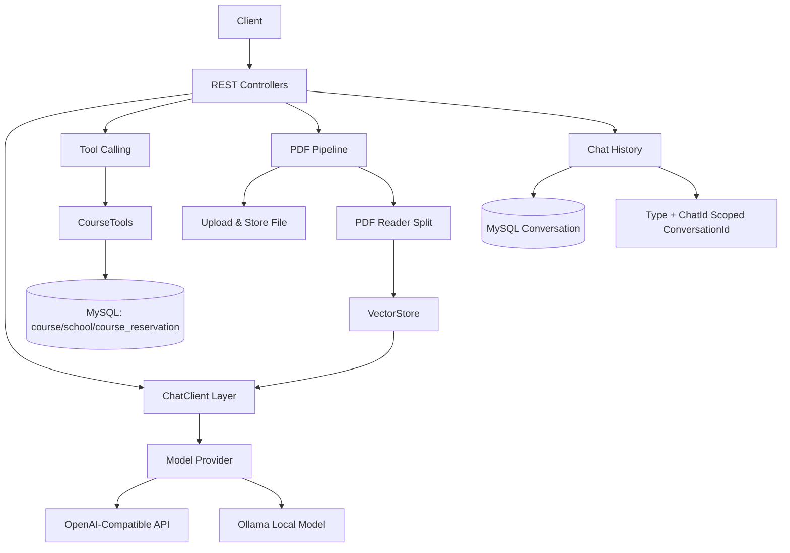

# ai-demo

🔥 A Spring AI backend demo based on Spring Boot, Java, and PDF RAG workflows.
🚀 Built for chat, tool calling, multimodal input, vector retrieval, and conversation history management.
⭐ Provides an extensible reference for AI application backends, observability, and production-minded evolution.

> 一个面向教学与业务验证场景的 Spring AI 示例项目，覆盖了文本聊天、多模态输入、工具调用、PDF 知识库问答（RAG）和会话历史管理等完整链路。
> 该项目的目标不是“最短 Demo”，而是提供一个可扩展、可观测、可演进的 AI 应用后端参考实现。

---

## 目录

- 项目定位与设计目标
- 功能总览
- 技术栈与版本基线
- 系统架构
- 核心模块说明
- 快速开始
- 数据库初始化
- 配置说明与环境变量
- API 使用说明
- 工具调用与业务约束设计
- RAG 设计说明（PDF）
- 会话与历史管理策略
- 可观测性与排障手册
- 安全建议与脱敏策略
- 性能优化建议
- 生产化落地建议
- 项目设计补充
- 常见问题（FAQ）
- 路线图

---

## 项目定位与设计目标

`ai-demo` 是一个“功能闭环型”的 AI 应用后端样例。相比只演示一次模型调用的入门项目，它更强调以下几点：

1. **业务闭环完整**：不仅能聊天，还能做客服流程、课程查询、预约写入、文档问答和会话追溯。
2. **多模态能力接入**：同一接口支持纯文本与附件输入，便于逐步扩展图像/文档混合交互。
3. **工具调用可控**：通过 `@Tool` 暴露业务操作，并用系统提示词约束模型在流程上的行为边界。
4. **RAG 可落地**：将 PDF 切页入库，基于向量检索增强回答，形成“上传-检索-问答”完整通路。
5. **可演进架构**：当前实现偏教学与验证，但模块边界清晰，便于后续替换为生产级存储与组件。

---

## 功能总览

- **通用流式聊天**：`/ai/chat` 支持分片输出，适合前端实时渲染。
- **多模态聊天**：同一接口可附带文件，底层以 `Media` 形式传入模型。
- **客服工作流**：`/ai/service` 绑定专用系统提示词与业务工具，模拟课程咨询与预约流程。
- **PDF 上传与问答**：`/ai/pdf/upload/{chatId}` 写入向量库；`/ai/pdf/chat` 执行检索增强回答。
- **会话历史管理**：按业务类型维护 `chatId` 列表，可按会话读取完整消息链。
- **向量能力验证**：测试代码包含向量距离、PDF 检索示例，便于二次实验。

---

## 技术栈与版本基线

- Java 17
- Spring Boot 3.4.3
- Spring AI 1.0.0-M6（BOM）
- Spring AI OpenAI / Ollama / PDF Reader / VectorStore
- MyBatis-Plus 3.5.12
- MySQL（业务数据与可选会话数据）
- Lombok 1.18.36
- Maven 构建

说明：项目同时保留了 Ollama 与 OpenAI 兼容接口配置。默认示例通过 OpenAI 兼容网关调用模型，并支持 embedding 模型用于向量化。

---

## 系统架构



---

## 核心模块说明

### 1) 对话入口层（Controller）

- `ChatController`：通用聊天入口，支持文件附件与流式输出。
- `CustomerServiceController`：客服场景专用入口，调用带工具能力的 `serviceChatClient`。
- `PdfController`：负责 PDF 上传、下载、向量化写入与检索问答。
- `ChatHistoryController`：按业务类型与 `chatId` 查询历史。

### 2) AI 客户端配置层（Configuration）

- `CommonConfiguration` 提供三个不同用途的 `ChatClient`：
  - `chatClient`：通用聊天。
  - `serviceChatClient`：绑定系统提示词与工具。
  - `pdfChatClient`：附加 `QuestionAnswerAdvisor`，执行向量检索增强。

### 3) 工具调用层（Tool Calling）

- `CourseTools` 使用 `@Tool` 暴露三类业务能力：
  - 课程查询（带空参兜底与排序字段白名单）
  - 校区查询
  - 预约单写入并返回单号

### 4) 存储层

- 业务数据：MySQL（课程、校区、预约）。
- 会话上下文与历史：`conversation` 表（按 `type::chatId` 持久化）。
- 历史查询：`MysqlChatHistoryRepository` 按业务类型分页读取会话与消息。
- 文件与向量：本地文件 + `SimpleVectorStore`（可持久化快照）。

---

## 快速开始

### 前置条件

- JDK 17+
- Maven 3.9+
- MySQL 8.x
- 可用的大模型 API Key（OpenAI 兼容）
- 可选：本地 Ollama 服务（若需要切换本地模型）

### 本地启动

```bash
cd ai-demo
mvn -DskipTests compile
mvn spring-boot:run
```

默认服务端口为 Spring Boot 默认端口（`8080`），如需变更请在 `application.yml` 中增加 `server.port`。

---

## 数据库初始化

可参考以下最小建表脚本（根据你自己的业务再扩展索引和约束）：

```sql
CREATE DATABASE IF NOT EXISTS `ai-demo` DEFAULT CHARACTER SET utf8mb4 COLLATE utf8mb4_unicode_ci;
USE `ai-demo`;

CREATE TABLE IF NOT EXISTS `course` (
  `id` INT PRIMARY KEY AUTO_INCREMENT,
  `name` VARCHAR(128) NOT NULL,
  `edu` INT NULL COMMENT '0-无,1-初中,2-高中,3-大专,4-本科以上',
  `type` VARCHAR(32) NULL COMMENT '编程/设计/自媒体/其他',
  `price` BIGINT NULL,
  `duration` INT NULL COMMENT '单位: 天'
);

CREATE TABLE IF NOT EXISTS `school` (
  `id` INT PRIMARY KEY AUTO_INCREMENT,
  `name` VARCHAR(128) NOT NULL,
  `city` VARCHAR(64) NULL
);

CREATE TABLE IF NOT EXISTS `course_reservation` (
  `id` INT PRIMARY KEY AUTO_INCREMENT,
  `course` VARCHAR(128) NOT NULL,
  `student_name` VARCHAR(64) NOT NULL,
  `contact_info` VARCHAR(128) NOT NULL,
  `school` VARCHAR(128) NOT NULL,
  `remark` VARCHAR(255) NULL
);

CREATE TABLE IF NOT EXISTS `conversation` (
  `id` BIGINT PRIMARY KEY,
  `conversation_id` VARCHAR(128) NOT NULL,
  `message` TEXT NOT NULL,
  `type` VARCHAR(32) NOT NULL,
  `create_time` DATETIME NOT NULL
);

CREATE INDEX `idx_conversation_id_create_time`
  ON `conversation` (`conversation_id`, `create_time`);
```

---

## 配置说明与环境变量

关键配置位于 `src/main/resources/application.yml`，已做脱敏处理，推荐通过环境变量注入：

- `OPENAI_API_KEY`：模型调用密钥（必填）
- `OPENAI_BASE_URL`：兼容接口地址（可选）
- `DB_URL`：数据库连接串
- `DB_USERNAME`：数据库用户名
- `DB_PASSWORD`：数据库密码

示例：

```bash
export OPENAI_API_KEY="your_key"
export DB_USERNAME="root"
export DB_PASSWORD="your_password"
```

---

## API 使用说明

### 1) 通用聊天（支持附件）

`POST/GET /ai/chat`

参数：
- `prompt`：用户问题
- `chatId`：会话标识
- `files`：可选，多文件

示例（文本）：

```bash
curl -N "http://localhost:8080/ai/chat?prompt=你好&chatId=c1"
```

示例（附件）：

```bash
curl -N -X POST "http://localhost:8080/ai/chat" \
  -F "prompt=请描述这张图" \
  -F "chatId=c2" \
  -F "files=@/path/to/image.png"
```

### 2) 客服会话

`GET /ai/service?prompt=...&chatId=...`

```bash
curl "http://localhost:8080/ai/service?prompt=我想学编程，帮我推荐课程&chatId=s1"
```

### 3) PDF 上传

`POST /ai/pdf/upload/{chatId}`

```bash
curl -X POST "http://localhost:8080/ai/pdf/upload/p1" \
  -F "file=@./doc.pdf"
```

### 4) PDF 问答

`GET /ai/pdf/chat?prompt=...&chatId=...`

```bash
curl -N "http://localhost:8080/ai/pdf/chat?prompt=这份文档的核心观点是什么&chatId=p1"
```

### 5) 历史会话

- `GET /ai/history/{type}`
- `GET /ai/history/{type}/{chatId}`

`type` 取值建议：`chat` / `service` / `pdf`

说明：
- 两个接口都支持 `page`、`pageSize` 参数。
- 历史会话已按业务类型做隔离，底层会把 `type` 与 `chatId` 组合成独立的 `conversationId`，避免不同场景复用同一个 `chatId` 时串历史。

---

## 工具调用与业务约束设计

本项目的客服能力不是“自由聊天”，而是“流程型对话 + 数据工具”组合：

1. 通过系统提示词限定角色、语气、步骤和安全边界。
2. 通过 `@Tool` 暴露受控业务动作，避免模型编造结构化数据。
3. 把“可执行动作”与“自然语言表达”分离：
   - 表达由模型负责
   - 数据查询/写入由后端工具负责

这种设计在实际业务里非常关键，能显著降低幻觉风险，并提升可审计性。

---

## RAG 设计说明（PDF）

`PdfController` 的主流程如下：

1. 校验并保存上传文件
2. 用 `PagePdfDocumentReader` 按页拆分文档
3. 写入 `VectorStore`
4. 问答阶段通过 `QuestionAnswerAdvisor` 注入检索结果
5. 用 `FILTER_EXPRESSION` 限定仅检索当前会话关联文件

这个策略避免了多文件混检导致的上下文污染，是单会话文档问答场景中非常实用的一步。

---

## 会话与历史管理策略

当前实现已切到数据库持久化：

- `MysqlChatMemory` 负责保存模型上下文
- `MysqlChatHistoryRepository` 负责按业务类型分页读取历史列表与消息明细
- `type::chatId` 作为统一的 `conversationId`，确保 `chat / service / pdf` 三类会话互不串线

生产实践中建议：

- 会话上下文使用 Redis 或数据库做持久化
- 历史索引与上下文分离存储
- 引入 TTL 与归档策略，控制长期存储成本

---

## 可观测性与排障手册

### 日志

当前配置将 `org.springframework.ai` 与应用包设为 `debug`，便于学习阶段观察调用细节。
线上建议降级为 `info` 并做采样。

### 常见排障路径

1. 接口有响应但模型为空：优先检查 `OPENAI_API_KEY` 与网络连通性。
2. PDF 问答命中率低：检查 embedding 模型、切页粒度、阈值与 query 质量。
3. 客服流程跑偏：先排查系统提示词与工具参数描述是否足够明确。
4. 会话丢失：确认 `chatId` 是否稳定传递，并检查 `conversation` 表中是否已经写入对应的 `type::chatId` 记录。

---

## 安全建议与脱敏策略

项目已完成基础脱敏（密钥与数据库账号密码改为环境变量）。进一步建议：

- 不在仓库提交任何 `.env`、`workspace.xml`、`dataSources.xml`。
- API Key 使用密钥管理服务（Vault/KMS/Secret Manager）。
- 对外接口增加鉴权与限流。
- 记录工具调用审计日志（谁在何时触发了什么操作）。
- 对上传文件做大小、类型、病毒扫描和内容安全校验。

---

## 性能优化建议

- 将 `SimpleVectorStore` 替换为专用向量数据库（pgvector/Milvus/Weaviate）。
- 增加 embedding 缓存，减少重复向量化。
- 对聊天输出采用反压与超时控制，提升高并发稳定性。
- 为 `conversation` 表补分区/归档策略，控制长会话的查询成本。
- 对工具查询建立合适索引，避免预约和查询链路被数据库拖慢。

---

## 生产化落地建议

如果把该项目推进到生产，可按以下路线分阶段实施：

1. **阶段一：稳定性**
   - 增加统一异常处理、链路追踪、超时控制、熔断重试。
2. **阶段二：安全性**
   - 接入鉴权、审计、脱敏、最小权限数据库账户。
3. **阶段三：可运营性**
   - 增加提示词版本管理、A/B 测试、效果回放和评测基线。
4. **阶段四：可扩展性**
   - 抽象模型提供方，支持多模型路由与成本控制策略。

---

## 项目设计补充

### 实现路径

`ai-demo` 按“先闭环、再增强”的顺序推进：

1. 先完成通用聊天接口，验证模型接入和流式输出；
2. 再增加客服场景与 `@Tool` 工具调用，把 AI 回答和业务动作串起来；
3. 然后补 PDF 上传、切片、向量化和检索问答，让系统具备 RAG 能力；
4. 最后增加会话历史、多模态文件输入和可观测性说明，让项目具备更完整的后端服务结构。

### 关键难点

项目的难点主要集中在让 RAG 真正产生价值：

- PDF 文档不能直接交给模型回答，必须先切片、向量化和检索；
- 召回内容过多会挤占上下文，过少则容易答不全；
- 如果不做文件范围隔离和工具边界控制，就容易出现跨文档污染和幻觉回答。

### 当前处理方式

当前实现主要采用了以下做法：

- 用 `QuestionAnswerAdvisor + VectorStore` 把检索结果接入问答链路，而不是手工拼接上下文；
- 把 PDF 走“上传 -> 解析 -> 切片 -> 向量化 -> 检索问答”完整闭环，保证知识库能力可以独立验证；
- 在客服场景中给工具调用增加系统提示和流程约束，减少模型随意输出和越权操作；
- 用 `type::chatId` 维护会话与文档范围，并给历史接口加分页，降低不同会话之间相互污染和长对话拖慢接口的风险；
- 同时保留会话历史与多模态输入能力，为后续扩展留出空间。

### 后续优化方向

如果继续迭代，优先级较高的方向包括：

- 引入更细的切片策略和重排机制，提升 RAG 召回质量；
- 给检索问答增加来源展示和置信度提示，降低幻觉风险；
- 把会话上下文进一步拆到 `Redis + MySQL` 组合，兼顾响应速度与可恢复性；
- 增加自动化评测、回归测试和效果基线；
- 把工具调用失败、模型超时和异常响应做成统一降级策略。

---

## 常见问题（FAQ）

### Q1：必须使用 OpenAI 兼容接口吗？
不是。项目已有 Ollama 相关配置，可按需要切换本地模型。

### Q2：为什么客服回答要限制流程？
因为流程限制能减少幻觉与越权操作，尤其在预约、订单、支付等业务里非常关键。

### Q3：RAG 为什么要加文件过滤表达式？
避免跨会话或跨文档污染结果，确保答案来源清晰。

### Q4：能否把会话历史全放数据库？
可以，当前默认实现已经把会话上下文和历史索引都落到了 MySQL；如果后续量级增大，建议再把热点上下文前移到 Redis。

### Q5：这份代码适合直接商用吗？
更适合作为高质量样例与 PoC 基线，商用前建议补齐鉴权、运维、监控和安全链路。

---

## 路线图

- [ ] 增加统一 API 响应规范与错误码体系
- [ ] 增加 OpenAPI/Swagger 文档
- [ ] 支持向量库可插拔实现
- [ ] 增加 Redis 会话持久化
- [ ] 增加提示词模板中心与版本管理
- [ ] 增加自动化评测与回归测试

---

如果你正在搭建一个“既能演示能力、又能承载真实业务迭代”的 Spring AI 项目，这个仓库可以作为一个非常好的起点。欢迎基于它继续扩展并提交改进建议。

---

## 开源

本项目以开源方式提供，欢迎学习、Fork 和二次开发。
建议在企业或生产场景落地前，补齐鉴权、审计、监控与安全合规能力。
如需用于团队协作，可在此基础上补充 `LICENSE`、`CONTRIBUTING` 和 `SECURITY` 文档。
