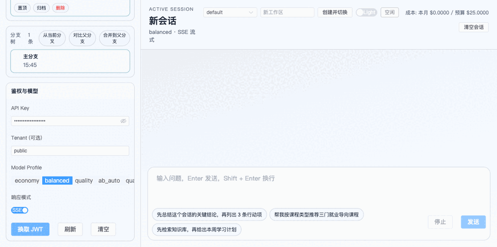
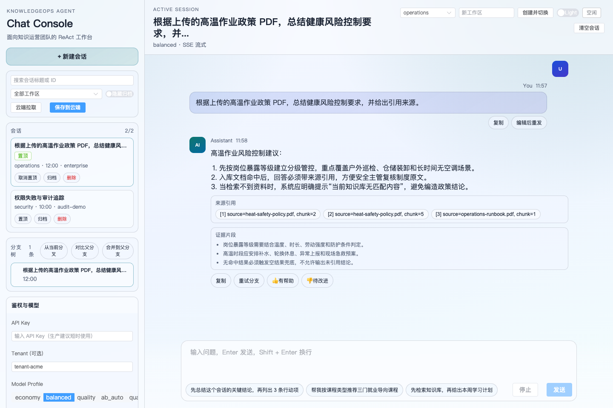
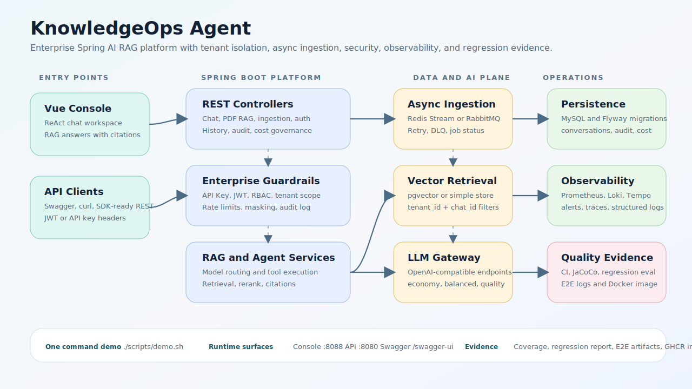
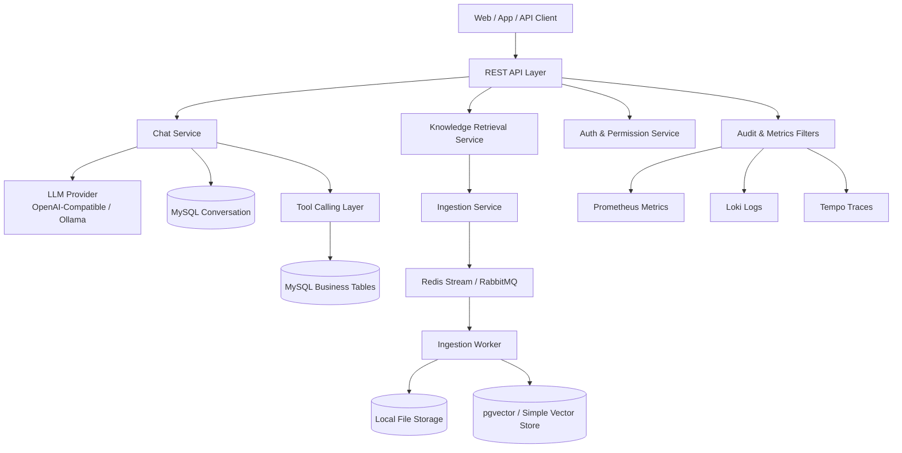

# KnowledgeOps Agent | Enterprise Spring AI RAG Platform | 智能问答与知识运营平台

[](https://github.com/however-yir/knowledgeops-agent/actions/workflows/ci.yml)
[](https://github.com/however-yir/knowledgeops-agent/releases)
[](https://however-yir.github.io/knowledgeops-agent/)
[](LICENSE)
[](https://github.com/however-yir/knowledgeops-agent/pkgs/container/knowledgeops-agent)

KnowledgeOps Agent is an enterprise Spring AI RAG platform that turns document knowledge into deployable, governed, and measurable AI workflows. It combines tenant-isolated retrieval, asynchronous PDF ingestion, JWT/API key/RBAC security, audit trails, Prometheus/Loki/Tempo observability, and regression evaluation so teams can verify the system as a platform instead of treating it as a one-off demo.

> 面向企业知识运营场景的 Spring AI RAG 旗舰项目：覆盖"企业 RAG、租户隔离、异步入库、权限审计、可观测、回归评测"全链路，目标是提供可部署、可运维、可验证的生产级工程基线。



## Why It Is More Than a Demo

| Proof point | Repository evidence |
|---|---|
| Enterprise RAG | PDF upload, async ingestion jobs, tenant-scoped retrieval, answer citations, evidence snippets |
| Tenant and permission boundary | API Key, JWT, refresh token lifecycle, RBAC permissions, tenant headers, audit logging |
| Operations baseline | Docker Compose, Flyway migrations, structured logs, Prometheus metrics, Loki logs, Tempo traces, Alertmanager rules |
| Quality evidence | Unit tests, Testcontainers integration tests, JaCoCo, regression evaluation, E2E smoke logs, Docker image build |
| Extensible AI workflow | Spring AI chat, ReAct trace payloads, SSE token streaming, model routing, tool execution hooks |

## Product Surfaces

| Surface | What to inspect |
|---|---|
| Console workspace | Session branches, streaming mode, model profile, JWT/API key auth, tenant context |
| RAG answer | Citation chips, evidence snippets, empty-result fallback policy |
| API surface | Swagger UI, curl recipes, chat/RAG/ingestion/auth/audit endpoints |
| Operations surface | Health, Prometheus metrics, E2E artifacts, regression reports, container image |



## Architecture At a Glance



## 5-Minute Proof Path

```bash
git clone https://github.com/however-yir/knowledgeops-agent.git
cd knowledgeops-agent
./scripts/demo.sh
```

After startup:

- Frontend console: `http://localhost:8088`
- Backend API: `http://localhost:8080`
- Swagger UI: `http://localhost:8080/swagger-ui/index.html`
- Local demo API key: see the seeded development value in `.env.example` or the authentication card in the frontend console.

Prefer Make targets if you use `make`:

```bash
make demo
make demo-verify
make demo-down
```

## Evidence Links

- Documentation: [however-yir.github.io/knowledgeops-agent](https://however-yir.github.io/knowledgeops-agent/)
- Latest release: [v1.0.0](https://github.com/however-yir/knowledgeops-agent/releases/tag/v1.0.0)
- Reproducible demo script: [docs/demo-script.md](docs/demo-script.md)
- Operations guide: [docs/operations.md](docs/operations.md)
- Enterprise architecture: [docs/architecture-enterprise.md](docs/architecture-enterprise.md)

## AI 工程作品矩阵

KnowledgeOps Agent 是 however-yir AI 工程作品矩阵中的"企业级 Spring AI RAG 平台"。这组主项目覆盖企业 RAG、业务 Agent、知识治理、AI 工程执行平台和云原生微服务集成五类方向。

| Repo | 定位 | 核心场景 | 技术重点 |
|---|---|---|---|
| [`knowledgeops-agent`](https://github.com/however-yir/knowledgeops-agent) | 企业级 Spring AI RAG 平台 | 企业知识问答、权限治理、可观测部署 | Spring AI、RAG、JWT/RBAC、异步入库、Observability |
| [`tianji-ai-agent`](https://github.com/however-yir/tianji-ai-agent) | 业务 Agent 工程案例（学习/展示用途） | 课程咨询、课程推荐、购买流程、多智能体路由 | Java、Spring AI、Tool Calling、MCP、SSE、多模态 |
| [`nebula-kb`](https://github.com/however-yir/nebula-kb) | 知识运营中枢 | 知识入库、知识治理、检索问答、反馈闭环 | Django、PostgreSQL、Redis、知识资产生命周期 |
| [`forgepilot-studio`](https://github.com/however-yir/forgepilot-studio) | AI 工程执行工作台 | AI 编程任务、执行编排、审计回放、团队工作台 | Python、FastAPI、React、Runtime Sandbox、MCP |
| [`however-microservices-lab`](https://github.com/however-yir/however-microservices-lab) | 云原生微服务 + AI 集成实验室 | 多语言微服务、Kubernetes、gRPC、AI 服务接入 | Go、Python、Java、Node.js、C#、K8s、Ollama/Gemini |

---

## 目录

- Why It Is More Than a Demo
- Product Surfaces
- Architecture At a Glance
- 5-Minute Proof Path
- Evidence Links
- AI 工程作品矩阵
- 项目定位
- Why KnowledgeOps Agent?
- 企业级能力矩阵
- 技术栈与版本基线
- 架构总览
- 核心模块
- 快速开始
- 容器化部署
- 生产部署建议
- 环境变量与配置项
- API 概览
- 安全与权限体系
- 可观测与运维
- 测试与质量保障
- 性能与容量规划
- 文档索引
- 路线图

---

## 项目定位

本项目按"企业级 Spring AI RAG 平台"设计，不停留在单接口聊天示例，而是把知识入库、检索问答、租户与权限边界、审计可追溯、可观测运维、质量回归放在同一条可验证链路里。它适合作为企业知识库、智能客服、内部运营助手或 AI 平台工程基线继续扩展。

重点解决以下问题：

1. 如何把对话能力稳定落在业务流程中，而不是仅做单轮聊天。
2. 如何把 PDF/文档知识接入检索增强链路，并保证可追溯来源。
3. 如何让工具调用具备权限边界、审计记录和失败可恢复机制。
4. 如何实现线上可运维：日志、指标、链路追踪、告警、回归评测闭环。

适用场景：

- 智能客服与企业知识问答
- 内部知识库检索问答（文档上传、切片、向量化、检索）
- 需要 AI + 业务工具联合执行的流程型场景

---

## Why KnowledgeOps Agent?

| Capability | KnowledgeOps Agent | Typical RAG demo | Typical Spring AI sample |
|---|---|---|---|
| Deployable full stack | Spring Boot API, Vue console, MySQL, Redis/RabbitMQ, pgvector, Docker Compose | Often API-only or notebook-level | Usually focused on one framework feature |
| Tenant-aware security | API Key, JWT, refresh tokens, RBAC, tenant headers, audit logs, rate limits | Rarely included | Usually omitted for clarity |
| Async ingestion | Redis Stream or RabbitMQ queues, retries, DLQ, idempotency, job status | Often synchronous upload and parse | Usually sample-specific |
| RAG production path | Tenant-scoped retrieval, citations, chunking, reranking hooks, pgvector indexes | Basic vector lookup | Demonstrates core API usage |
| Observability | Prometheus, Loki, Tempo, Alertmanager, structured logs, runbooks | Usually absent | Minimal or external |
| Quality gates | Unit tests, integration tests, CI, regression evaluation, k6 load scripts | Manual validation | Varies by example |

---

## 企业级能力矩阵

| 能力域 | 当前实现 |
|---|---|
| 对话与多模态 | `/ai/chat` 支持文本与附件输入、流式输出 |
| 检索增强（RAG） | `/ai/pdf/upload/{chatId}` + `/ai/pdf/chat`，按 `tenant_id + chat_id` 检索，支持引用来源输出 |
| 异步入库流水线 | 队列化 ingestion、租户级幂等键、重试、DLQ、状态查询 |
| 安全体系 | API Key + JWT + Refresh Token + RBAC + 细粒度权限 |
| 合规与审计 | 请求审计日志、保留策略、敏感信息脱敏 |
| 数据持久化 | MySQL 会话与业务数据、pgvector 向量检索（可切 simple） |
| 可观测性 | Prometheus + Loki + Tempo + Alertmanager + Promtail |
| 工程质量 | Flyway 迁移、CI、单测/集成测试、JaCoCo 覆盖率、回归评测脚本、压测脚本 |

---

## 技术栈与版本基线

- Java 17
- Spring Boot 3.4.3
- Spring AI 1.0.0-M6
- MyBatis-Plus 3.5.12
- MySQL 8.x
- Redis 7.x
- RabbitMQ 3.x
- pgvector / SimpleVectorStore
- OpenTelemetry + Micrometer + Prometheus
- Maven 3.9+

---

## 架构总览



---

## 核心模块

### 1) API 层（Controllers）

- `ChatController`：通用问答入口（文本/附件）
- `CustomerServiceController`：流程型客服对话入口（绑定工具）
- `PdfController`：上传、下载、检索问答
- `IngestionController`：异步任务提交、状态查询、人工触发处理
- `AuthController`：API Key 生命周期 + JWT/Refresh Token
- `AuditController`：审计日志查询
- `ChatHistoryController`：历史会话分页与详情查询

### 2) 智能体与检索层

- 多 ChatClient 分场景配置（通用、客服、知识问答）
- 模型路由（按 `modelProfile` 与端点策略动态选型）
- `QuestionAnswerAdvisor` + 向量检索增强
- 会话隔离策略：`tenant_id + type::chatId` 组合，避免跨租户串会话
- ReAct 流式接口采用真实模型 token 流输出（非后处理切片）

### 3) 异步入库层

- 上传后创建 ingestion job
- 支持 `X-Idempotency-Key` 去重
- 队列消费失败重试 + DLQ
- 任务状态可追踪（pending/running/failed/success）

### 4) 安全层

- API Key 鉴权换取 JWT
- Refresh Token 续签
- 权限校验（注解 + 路由粒度）
- 限流、审计、日志脱敏

---

## 快速开始

### 前置条件

- JDK 17+
- Maven 3.9+
- Docker & Docker Compose（推荐）
- 有效模型密钥（OpenAI 兼容）

### 快速安装（Mac / Windows）

以下脚本会自动完成：

1. 检查 Docker / Docker Compose 是否可用
2. 自动生成 `.env`（若不存在）
3. 引导填写 `OPENAI_API_KEY`
4. 一键启动容器栈（`docker compose up --build -d`）

macOS：

```bash
chmod +x scripts/install_mac.sh
./scripts/install_mac.sh
```

Windows（PowerShell）：

```powershell
powershell -ExecutionPolicy Bypass -File .\scripts\install_windows.ps1
```

Windows（CMD/双击）：

```bat
.\scripts\install_windows.bat
```

### 本地开发启动

```bash
cd <project-root>
mvn -DskipTests compile
mvn spring-boot:run
```

默认端口：`8080`

### 一键容器启动（应用 + 中间件）

推荐使用 demo 脚本，它会生成本地 `.env.demo`、启动容器、等待健康检查，并执行一次端到端 smoke test：

```bash
./scripts/demo.sh
```

也可以直接使用 Docker Compose：

```bash
docker compose up --build -d
```

启动后访问：

- 前端控制台：`http://localhost:8088`
- 后端 API：`http://localhost:8080`
- RabbitMQ 控制台：`http://localhost:15672`

本仓库内置开发演示用管理员 API Key（仅限本地演示，生产必须轮换）。具体值请查看 `.env.example` 或前端「鉴权」卡片。

可在前端「鉴权」卡片中直接换取 JWT，或用 `X-API-Key` 直接请求接口。

---

## 容器化部署

`docker-compose.yml` 默认包含：

- `knowledgeops-agent`（应用）
- `knowledgeops-agent-mysql`
- `knowledgeops-agent-redis`
- `knowledgeops-agent-rabbitmq`
- `knowledgeops-agent-tempo-lite`
- `knowledgeops-agent-web`（Vue3 + Element Plus + Nginx）

观察栈独立文件：

```bash
docker compose -f docker-compose.observability.yml up -d
```

包含：Prometheus / Alertmanager / Loki / Tempo / Promtail。

---

## 生产部署建议

### 1) 最小生产拓扑

- 应用层：2~3 实例（无状态）
- MySQL：主从或高可用托管版本
- Redis：哨兵或托管高可用
- RabbitMQ：镜像队列或托管消息服务
- 向量存储：PostgreSQL + pgvector（建议独立实例）

### 2) 发布策略

- 推荐滚动发布或蓝绿发布
- 接口兼容遵循"先向后兼容，再灰度切流"
- Flyway 脚本纳入发布流水线（先迁移后流量）

### 3) 生产前检查

- 安全：必须启用 `APP_SECURITY_ENABLED=true`
- 密钥：必须注入 `APP_JWT_SECRET` 和 `OPENAI_API_KEY`
- 可观测：确认 metrics / logs / trace 已接通
- 回归：执行 `scripts/run_regression.py`
- 压测：执行 `performance/k6/distributed_chat_ingestion.js`

详细运行手册见 [docs/operations.md](docs/operations.md)。

---

## 环境变量与配置项

核心环境变量（节选）：

- `OPENAI_API_KEY`：模型访问密钥（必填）
- `OPENAI_BASE_URL`：OpenAI 兼容网关地址
- `DB_URL` / `DB_USERNAME` / `DB_PASSWORD`
- `APP_SECURITY_ENABLED`
- `APP_JWT_SECRET`
- `APP_VECTOR_STORE_BACKEND`：`pgvector` 或 `simple`
- `APP_PGVECTOR_URL` / `APP_PGVECTOR_USERNAME` / `APP_PGVECTOR_PASSWORD`
- `APP_INGESTION_QUEUE_BACKEND`：`redis_stream` 或 `rabbitmq` 或 `db_polling`

参考样例文件：`.env.example`

---

## API 概览

说明：多租户场景建议在请求头统一传递 `X-Tenant-Id`；会话历史、知识检索与入库任务均按租户隔离。

### 会话问答

- `GET/POST /ai/chat`
  - 参数：`prompt`, `chatId`, `files(可选)`, `modelProfile(可选)`

### ReAct 智能体问答

- `POST /ai/react/chat`（JSON 返回 Thought/Action/Observation 轨迹）
- `POST /ai/react/chat/stream`（SSE 实时返回 `trace/token/done/error`，`token` 为模型原生流）

### 客服流程问答

- `GET /ai/service`
  - 参数：`prompt`, `chatId`, `modelProfile(可选)`

### 知识入库与检索

- `POST /ai/pdf/upload/{chatId}`
- `GET /ai/pdf/file/{chatId}`
- `GET /ai/pdf/chat`
  - 参数：`prompt`, `chatId`, `modelProfile(可选)`
- `POST /ingestion/upload/{chatId}`
- `GET /ingestion/jobs/{jobId}`
- `GET /ingestion/jobs?chatId=...`
- `POST /ingestion/jobs/process`

### 历史与审计

- `GET /ai/history/{type}`
- `GET /ai/history/{type}/{chatId}`
- `GET /audit/logs`

### 鉴权与密钥生命周期

- `POST /auth/token`（Header: `X-API-Key`，可选 `X-Tenant-Id`）
- `POST /auth/refresh`（Header: `X-Refresh-Token`）
- `POST /auth/api-keys`（支持 `tenantId` 参数）
- `POST /auth/api-keys/rotate`（支持 `tenantId` 参数）
- `POST /auth/api-keys/revoke`（支持 `tenantId` 参数）

### API 文档

- Swagger UI：`/swagger-ui/index.html`
- OpenAPI JSON：`/v3/api-docs`

---

## 安全与权限体系

当前实现已覆盖：

- API Key 与 JWT 双鉴权
- Refresh Token 生命周期管理
- 租户隔离（`X-Tenant-Id`，tenant 级 API Key 与审计）
- RBAC + 权限矩阵
- 限流（Bucket4j，tenant + principal 复合维度）
- 审计日志与保留策略
- 上传文件类型/大小安全检查

生产建议：

- 密钥托管到 KMS / Vault
- 高敏动作开启双人复核
- 配置审计日志不可篡改存储
- 定期轮换 API Key 与 JWT Secret

---

## 可观测与运维

### 指标与健康检查

- `/actuator/health`
- `/actuator/prometheus`

### 日志

- JSON 结构化日志（含 `request_id` / `trace_id` / `chat_id`）
- 默认文件：`logs/knowledgeops-agent.log`

### 链路追踪

- OTLP 导出到 Tempo
- 支持按 `trace_id` 串联请求日志与调用链

### 告警基线

- `HighHttpP95Latency`
- `IngestionFailureRateHigh`

---

## 测试与质量保障

### 自动化测试

- Controller 层测试
- Security 组件测试
- Ingestion 服务测试
- Testcontainers（MySQL）集成测试

```bash
# 快速单元/切片测试，不启动 Testcontainers
mvn test

# 集成测试与烟测，包含 Testcontainers
mvn verify -Pintegration-test
```

### 回归评测

```bash
python3 scripts/generate_eval_dataset.py
python3 scripts/generate_eval_predictions.py
python3 scripts/run_regression.py --dataset evaluation/dataset.large.json --predictions evaluation/predictions.generated.json --threshold 0.75
```

### CI

GitHub Actions 工作流：`Intelligent QA Platform CI`

- Maven compile / test / verify（含 integration profile）
- JaCoCo 报告生成 + Codecov 上传
- Regression 评测脚本自动执行
- Docker Buildx + GHCR 推送

---

## 性能与容量规划

建议按以下维度持续压测与容量校准：

1. 问答接口 p95/p99 延迟
2. ingestion 队列堆积长度与重试率
3. 向量检索耗时与命中率
4. 单实例并发上限与 CPU/内存占用

压测脚本：

- `performance/k6/chat_ingestion_load.js`
- `performance/k6/distributed_chat_ingestion.js`
- `performance/k6/generate_report.py`
- `scripts/drills/run_distributed_drill.sh`

生成报告示例：

```bash
python3 performance/k6/generate_report.py --summary reports/performance/distributed-k6-summary.json
```

---

## 文档索引

- 运维手册：[docs/operations.md](docs/operations.md)
- 快速上手：[docs/getting-started.md](docs/getting-started.md)
- 可复现 Demo：[docs/demo-script.md](docs/demo-script.md)
- API 示例：[docs/api-recipes.md](docs/api-recipes.md)
- 企业部署指南：[docs/deployment-enterprise.md](docs/deployment-enterprise.md)
- 架构说明：[docs/architecture-enterprise.md](docs/architecture-enterprise.md)
- 分布式演练：[docs/drills/distributed-and-observability-drill.md](docs/drills/distributed-and-observability-drill.md)
- 演练模板：[docs/drills/runbook_template.md](docs/drills/runbook_template.md)
- 简历升级清单：[docs/resume-upgrade-checklist.md](docs/resume-upgrade-checklist.md)

---

## 路线图

- [x] 多租户隔离（租户级密钥、限流与审计）
- [x] 模型路由与成本控制策略（economy/balanced/quality）
- [ ] 检索重排策略可插拔实现
- [ ] 告警自动化处置脚本
- [ ] 企业 SSO（OIDC/SAML）接入

See the release-oriented roadmap in [docs/roadmap.md](docs/roadmap.md).

---

## 开源说明

本项目适合作为企业级智能问答与知识检索平台的后端工程基线。  
欢迎用于学习、二次开发与团队协作；在生产落地前请按组织规范补齐安全、合规与发布治理流程。
