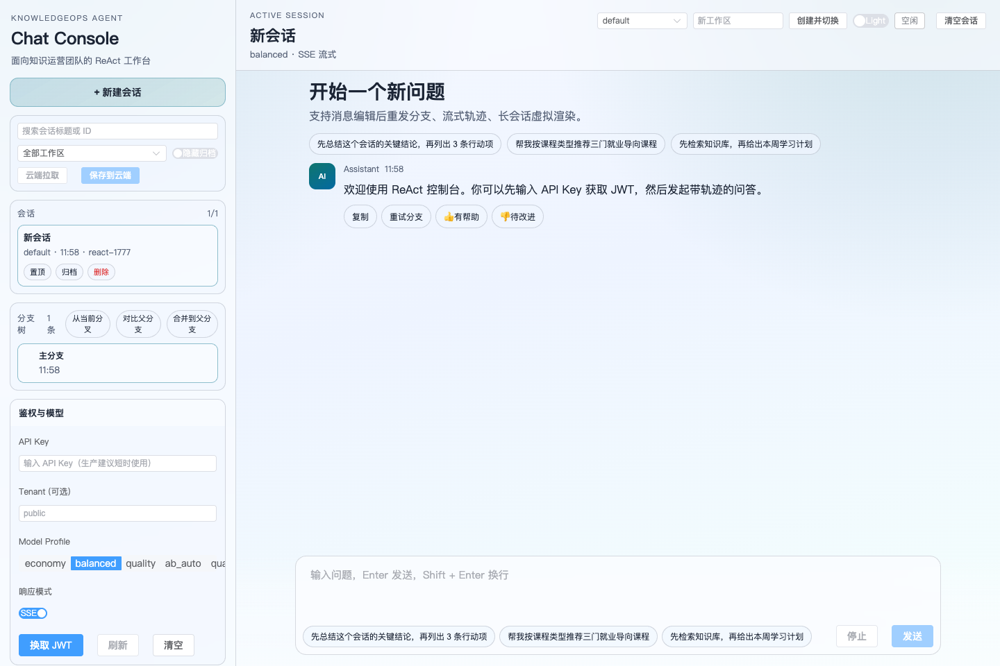

# KnowledgeOps Agent Documentation

KnowledgeOps Agent is an enterprise Spring AI RAG platform for tenant-isolated retrieval, asynchronous document ingestion, governed agent workflows, audit-ready security, production observability, and regression evaluation.

## Choose Your Path

| Goal | Start here | What you get |
|---|---|---|
| Run it locally | [Getting Started](getting-started.md) | Docker Compose startup, health checks, auth token flow, and teardown |
| Walk through the demo | [Reproducible Demo Script](demo-script.md) | Demo data, PDF upload, async ingestion, RAG questions, tenant and permission checks |
| Call the API | [API Recipes](api-recipes.md) | Copyable curl examples for chat, RAG, ingestion, ReAct, and observability |
| Understand the system | [Enterprise Architecture](architecture-enterprise.md) | Service boundaries, data flow, security, and observability architecture |
| Deploy it | [Enterprise Deployment Guide](deployment-enterprise.md) | Production topology, release checks, environment variables, and rollout notes |
| Operate it | [Operations Manual](operations.md) | Metrics, logs, traces, alerting, incident drills, and regression checks |
| Track future work | [Roadmap](roadmap.md) | v1.1.0 focus areas and backlog |

## Recommended First 15 Minutes

1. Start with [Getting Started](getting-started.md) and run `./scripts/demo.sh`.
2. Open [Reproducible Demo Script](demo-script.md) and upload `demo-data/heat-safety-policy.pdf`.
3. Use [API Recipes](api-recipes.md) to exchange the demo API key for a JWT.
4. Try `/ai/chat`, `/ingestion/upload/{chatId}`, then `/ai/pdf/chat`.
5. Review [Enterprise Architecture](architecture-enterprise.md) before changing data flow or security boundaries.
6. Check [Operations Manual](operations.md) before changing queue, vector store, or observability settings.

## Visual Proof

| Surface | Preview |
|---|---|
| Console workspace |  |
| RAG answer with citations |  |

## Documentation Map

| Section | Documents |
|---|---|
| Product overview | [Project README](https://github.com/however-yir/knowledgeops-agent#readme), [Roadmap](roadmap.md) |
| Local evaluation | [Getting Started](getting-started.md), [Reproducible Demo Script](demo-script.md), [API Recipes](api-recipes.md) |
| Architecture and deployment | [Enterprise Architecture](architecture-enterprise.md), [Enterprise Deployment Guide](deployment-enterprise.md) |
| Operations | [Operations Manual](operations.md), [Distributed and Observability Drill](drills/distributed-and-observability-drill.md), [Runbook Template](drills/runbook_template.md) |
| Career packaging | [Resume Upgrade Checklist](resume-upgrade-checklist.md) |

## Platform Capabilities

| Area | Coverage |
|---|---|
| AI workflows | Chat, PDF RAG, ReAct trace, tool calling, conversation history |
| Ingestion | Redis Stream or RabbitMQ queues, retries, DLQ, idempotency, status tracking |
| Security | API Key, JWT, refresh tokens, RBAC, tenant isolation, rate limiting, audit logs |
| Operations | Docker Compose, Flyway, Prometheus, Loki, Tempo, Alertmanager, structured logs |
| Quality | CI, unit tests, integration tests, regression evaluation, k6 load tests |

## Runtime Links

These links are available after the local stack is running:

| Surface | URL |
|---|---|
| Frontend console | `http://localhost:8088` |
| Backend API | `http://localhost:8080` |
| Swagger UI | `http://localhost:8080/swagger-ui/index.html` |
| OpenAPI JSON | `http://localhost:8080/v3/api-docs` |
| Health | `http://localhost:8080/actuator/health` |
| Prometheus metrics | `http://localhost:8080/actuator/prometheus` |
| RabbitMQ console | `http://localhost:15672` |

## Release and Community

- Latest release: [v1.0.0](https://github.com/however-yir/knowledgeops-agent/releases/tag/v1.0.0)
- Roadmap milestone: [v1.1.0](https://github.com/however-yir/knowledgeops-agent/milestone/1)
- Discussions: [GitHub Discussions](https://github.com/however-yir/knowledgeops-agent/discussions)
- Source repository: [however-yir/knowledgeops-agent](https://github.com/however-yir/knowledgeops-agent)
